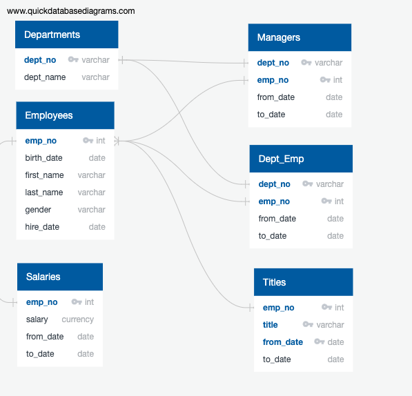
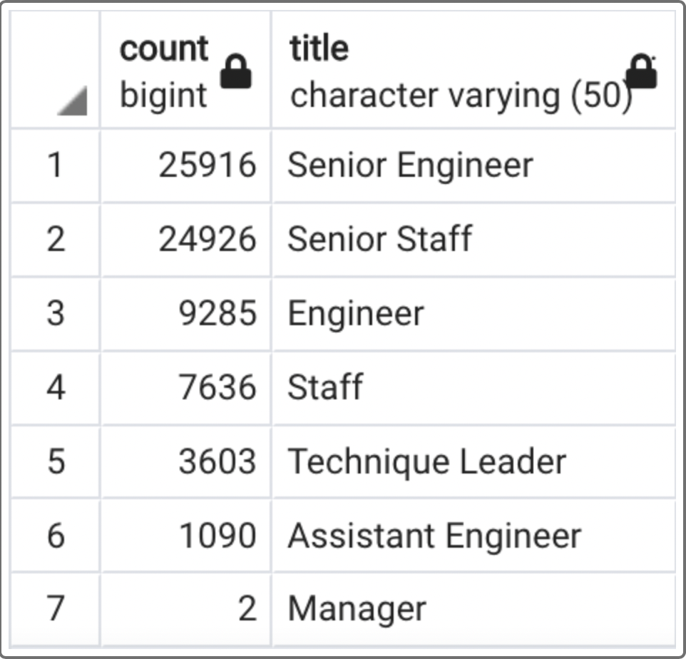

# Pewlett Hackard Analysis

## Project Overview
The purpose of this analysis is to provide Pewlett Hackard with a relational assessment of employee data and detailed information on the future retirees presently working at the company. 

The findings will be used to design a mentorship program for new-hires, led by retiring staff transitioning to part-time work. This will allow each department to more fluidly plan to hire new staff, according to the rate of retirment.

# Analysis Resources
- *Technologies used*: PostgreSQL, pgAdmin4, SQL, VS Code

## Results
- The data used in the analysis includes current employees with birth dates ranging from 1952 to 1955 and hired dates from 1985 to 1988.

### Entity Relationships
- The ERD (Entity Relationship Diagram) shows the Pewlett Hackard employee data is spread across 6 sources and depicts their relationship.

### Retiring employees 
-  86% of retiring employees hold Senior, Leader or Manager titles (62,172 / 72458).
- 36% of future retirees are classified as Senior Engineers.
- A total of 72,458 roles will need to be filled.

# Summary

- Hewlett Hackard will need to account for the "Silver Tsunami" by investing in recruitment and leadership development.
- The Engineering department will see the highest impact, 36% of Senior staff getting ready to retire.
- Pewlett Hackard could start initiatives with internal recruitment of Engineers from other departments. The initiative could serve three purposes:
  - Train current non-Senior Engineers on leadership skills needed to become Senior engineers.
  - Train the Engineering depart on how to collectively train and recruit new Engineers.
  - Restaff the Engineering team without the expense of external hiring 

